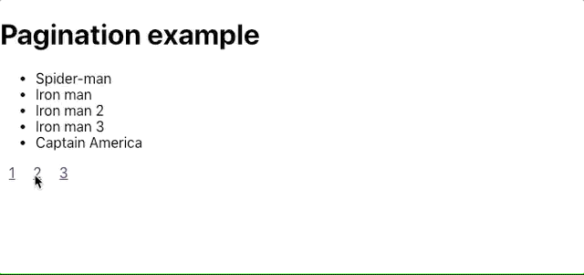
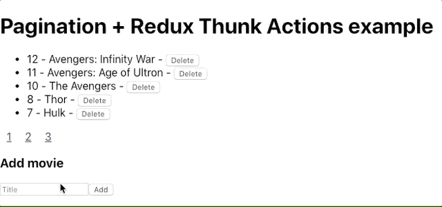
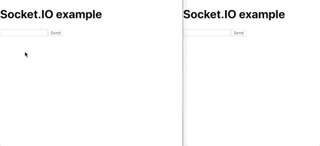

# JavaScript code examples
In this project you will find pure (as possible) examples of some techniques and code.

## Table of content
1. [Pagination](#pagination)
2. [Redux Thunk Action](#redux-thunk-action)
3. [SocketIO Basics](#socketio)
4. [SocketIO rooms](#socketio-rooms)

## Pagination
A full example (front- and back-end) how to make a pagination based on a url query.

[^ Table of content](#table-of-content)

## Redux Thunk Action
A full example how to use redux and thunk action creators to update a paginated list that is stored in the redux state.

[^ Table of content](#table-of-content)

## SocketIO
A basic example how to setup and connect to an socketIO server. To understand how to use socketIO in a real project, we create a chat app.

[^ Table of content](#table-of-content)

## SocketIO rooms
_Currently been written_
A more advanced example what we can do with SocketIO. We will create a multiroom chat app. You can see who is in which room and you can join and switch between rooms

[^ Table of content](#table-of-content)